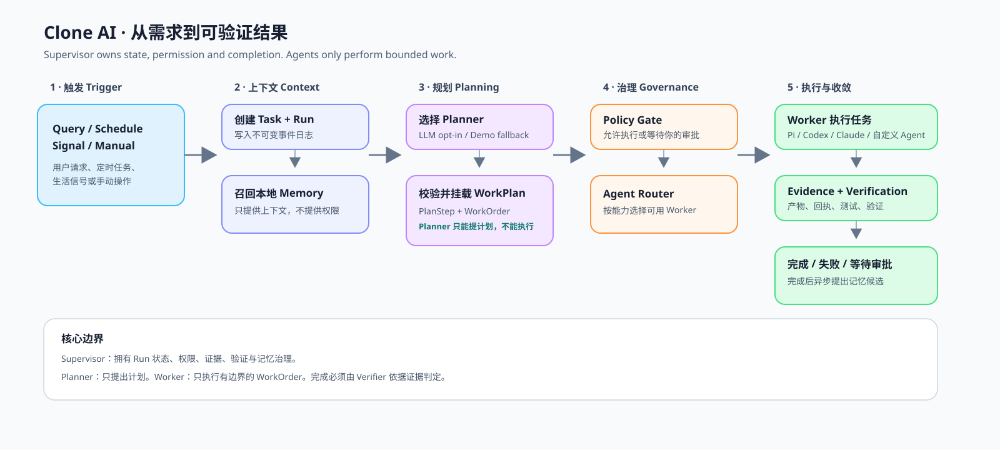

# Query 的完整执行流程

[English](query-execution-flow.md) · **简体中文**

这份文档描述的是**当前真实能跑的链路**，不是最终产品愿景。请从上往下看：
Supervisor 拥有整个过程；Planner 与 Worker Agent 都被限制在更小的权限边界内。



## 真实链路：一步一步看

### 1. Trigger 进入 Runtime

`startDemoWorkflow()` 可以接收 `query`、`schedule`、`signal` 或 `manual` 四类触发。
Runtime 会创建持久化的 `Trigger`、`Task` 和 `Run`，把事件写进 JSONL Journal，再把 Run
切换到 `planning`。

**权限边界：**只有 Runtime 可以创建或改变父任务 Run 的状态。

### 2. 召回有关的本地记忆

`LocalMemoryStore` 会在用户可治理的 active Memory 中，按当前 Query 做关键词匹配排序。选中的
记忆摘要会被记录为 `memory.recalled` 事件，并作为上下文交给 Planner。

Memory 能帮助 Planner 理解偏好与历史，但不能授予权限、改变 Policy，也不能暗中触发外部动作。

派发时会发生第二次召回：Kernel 以 WorkOrder 的目标为查询，为每次派发编译一个有作用域的记忆包，
经唯一的共享 Worker Prompt 注入。因此每个 Provider 都收到同一份由所有者审核过的上下文，
而每个记忆包都会连同它到达的步骤与 WorkOrder 一起记入 Journal。

### 3. Planner 提出有边界的计划

默认使用确定性的 `buildDemoPlan()`：这样 Demo 可重复运行，也不会意外产生付费模型调用。当设置
`CLONE_AI_PLANNER=openai` 和 `OPENAI_API_KEY` 时，`LlmWorkPlanner` 才会调用 OpenAI
Responses 模型，要求它返回一次严格的 `create_work_plan` Function Call。

计划包含 `PlanStep`；需要协作时，每个步骤还会包含子 `SubagentWorkOrder`。WorkOrder 会明确写出：
目标、所需能力、输入、预期 Evidence/Artifact、验收标准、风险、预算和依赖。

Planner **只能提出数据**。它不能执行 Tool、写入记忆、批准操作，也不能宣布 Run 已完成。

### 4. Clone AI 校验并保存计划

`LlmWorkPlanner` 会先拦截不合格的模型计划：未知 Agent 或能力、非法风险等级、缺少产物合同、错误依赖、
不安全的重试预算都会校验失败。模型只获得一次纠正机会；再次不合法就安全失败。

`CloneRuntime.attachPlan()` 再执行 Runtime 的权威校验，写入 `plan.created`，并把 Run 切换为 `queued`。

### 5. Policy 决定是否允许执行

每个 PlanStep 真正开始前，`DefaultPolicyEngine` 会判断它是允许执行，还是必须等待精确审批。
`external_side_effect` 与 `irreversible` 会停在 `waiting_approval`。**模型能够规划危险动作，不等于它获得了执行权限。**

### 6. Supervisor 路由并派发 Worker

`CapabilityDispatcher` 会检查被选中的 Adapter 是否具备 WorkOrder 要求的全部能力。没有依赖关系的
WorkOrder 按批次并行；有依赖的 WorkOrder 只会收到前置任务已经验证过的 Evidence。

当前 Pi 是第一个真实接入的、无 Tool 的 JSONL Adapter。设置中的 Codex 和 Claude Code 目前仍会使用
确定性的 Demo Adapter，因此它们还不是真实的执行集成。

### 7. Worker 返回事件与证据

Worker 可以流式返回进度、Session 信息、Tool 事件、Evidence、完成或失败。Runtime 会把它们统一写入
Journal。Worker 的 `completed` 只是一个声明，不代表任务真的成功。

### 8. 验证决定 Run 的结果

Runtime 先检查每个 WorkOrder 的 Artifact Contract；之后 `EvidenceVerifier` 检查每一个 PlanStep 是否有
可观察的 Evidence，高风险步骤是否有带定位信息的持久 Receipt。只有验证通过，Run 才会进入 `completed`。

现在的 Verifier 是故意保持简单的第一层：它会检查证据合同与回执，但还不会深入检查文件内容、真实测试结果
或第三方连接器状态。这些是下一阶段要补的生产级 Verifier。

### 9. 完成后异步提出记忆候选

Run 完成会排入记忆提取请求。Memory Worker 带着 Evidence 来源提出候选，却不能直接写入个人长期记忆。
桌面客户端可以把候选同步到可查看的本地 Memory Store，所有者可以编辑或归档。

## 状态机

```text
created -> planning -> queued -> running -> verifying -> completed
                              |              |
                              |              -> failed
                              -> waiting_approval -> running

任何活跃状态都可以在收到取消请求后变为 cancelled。
```

## 已完成与尚未完成的边界

| 模块 | 当前状态 |
| --- | --- |
| Journal、Task/Run 状态、WorkOrder、依赖并行、Policy Gate | 已实现并有测试 |
| 记忆召回与异步候选 | 已实现；当前是关键词匹配，不是语义检索 |
| 显式开启的 LLM Planner、严格结构化输出、纠错 | 已实现并有单测；默认不会实际调用 API |
| Pi 受 Supervisor 管理的无 Tool Adapter | 已实现 |
| Codex、Claude Code 真实 Adapter | 尚未实现；当前配置走的是 Demo Adapter |
| Evidence 验证 | 初版合同/Receipt 验证；真实产物和连接器验证是下一步 |
| 世界模型、主动生活信号、外部 Tool Runtime | 规划中，尚未实现 |

## 推荐的代码阅读顺序

1. [`src/workflows/query-workflow.ts`](../src/workflows/query-workflow.ts)：整条链路的入口。
2. [`src/planning/llm-planner.ts`](../src/planning/llm-planner.ts)：模型提计划、系统校验计划的边界。
3. [`src/core/runtime.ts`](../src/core/runtime.ts)：Supervisor 与状态机。
4. [`src/agents/dispatcher.ts`](../src/agents/dispatcher.ts)：基于能力的安全路由。
5. [`src/core/verification.ts`](../src/core/verification.ts)：当前的完成关口。
